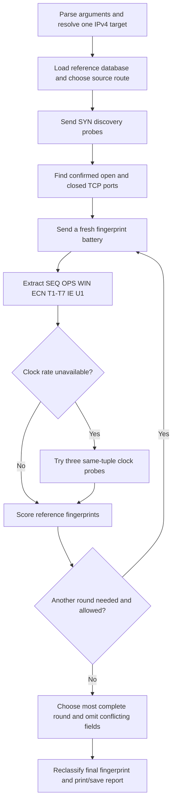

# Hand-built IPv4 OS fingerprinting scanner

This project discovers TCP ports, sends specially constructed TCP/ICMP/UDP
probes, extracts the target's network-stack behavior, and compares that behavior
with a published OS fingerprint database. It aims to identify an OS family and
the closest supported version or version range.

The entire implementation is in **[scanner.py](scanner.py)**. It uses only
Python's standard library. It does not invoke Nmap, import a Nmap wrapper,
use Scapy, or require a Python scanning package. The bundled **nmap-os-db is
third-party reference data**, not the scanning implementation.

**An OS fingerprint is an inference, not a remote version query.** Several OS
versions can expose the same behavior. A firewall, NAT, proxy, or kernel setting
can change the behavior observed. A 100% fingerprint match therefore does not
prove an exact installed kernel or Windows build. Nmap-equivalent version
accuracy has not been established for this implementation.

The [Nmap alignment review](SCANNER_REVIEW.md) records the verified methods,
compatibility fixes, tests, and remaining gaps. New reports record
`implementation_revision=2`; older captures remain readable but require a fresh
scan before a unique version candidate can be reported.

The detailed walkthrough in section 13 retains line references to the original
1,519-line snapshot. Those line numbers are historical; use the function names
to navigate the current source. Sections 6-10 and the review describe the updated
behavior, including the new sequence timing checks.

## Contents

1. [Files and requirements](#1-files-and-requirements)
2. [Install and run](#2-install-and-run)
3. [VM and remote-server demonstration](#3-vm-and-remote-server-demonstration)
4. [Every command and option](#4-every-command-and-option)
5. [What happens during a scan](#5-what-happens-during-a-scan)
6. [Packets and fingerprint fields](#6-packets-and-fingerprint-fields)
7. [Confidence, coverage, and decision rules](#7-confidence-coverage-and-decision-rules)
8. [Saved report and database formats](#8-saved-report-and-database-formats)
9. [Optional local calibration](#9-optional-local-calibration)
10. [Evaluation and verification](#10-evaluation-and-verification)
11. [Passive scan monitoring](#11-passive-scan-monitoring)
12. [Troubleshooting and accuracy limits](#12-troubleshooting-and-accuracy-limits)
13. [Code walkthrough in source order](#13-code-walkthrough-in-source-order)
14. [Database provenance and references](#14-database-provenance-and-references)

## 1. Files and requirements

### Files in the folder

| File | Purpose | Required for normal scanning? |
| --- | --- | --- |
| `scanner.py` | Packet construction, transport, extraction, matching, CLI, and optional monitoring | Yes |
| `nmap-os-db` | 6,108 reference fingerprints and their matching weights | Yes, unless you supply another compatible database |
| `NMAP-DATABASE-LICENSE.txt` | License terms supplied with the published database | Keep with the database |
| `README.md` | This usage and implementation guide | Documentation |
| `SCANNER_REVIEW.md` | Nmap comparison, fixes, verification, and remaining work | Documentation |
| `test_scanner.py` | Offline regressions and opt-in Linux loopback integration tests | Development only |

Earlier design PDFs, demo guides, and captured reports are not bundled.
Examples below that mention `vm.json`, `scanme.json`, `cases.json`,
or `fingerprints.json` refer to files **you create**, not bundled files.

### Runtime requirements

| Operation | Operating system | Privileges | Network needed? |
| --- | --- | --- | --- |
| `scan` | Linux, including a suitable WSL2 Linux environment | Root or raw-socket permissions such as `CAP_NET_RAW` | Yes |
| `watch` | Linux, with an Ethernet interface visible to the process | Root or raw-socket permissions | Yes, to observe traffic |
| `match` | Linux or Windows | Normal file access | No |
| `learn` | Linux or Windows | Write access to the local database | No |
| `evaluate` | Linux or Windows | Read access to reports/database; write access if saving results | No |

Use **Python 3.10 or newer**. No `pip install` step is needed. Live operations
use Linux raw sockets; native Windows Python cannot perform this tool's live
packet transport. The target itself may run Linux, Windows, BSD, or another OS
represented in the database.

The scanner accepts **one IPv4 address or hostname at a time**. It does not
accept IPv6, a CIDR subnet, a target list, or an IP-address range. TCP port ranges
are supported separately through `-p`.

For useful OS classification, the target should have at least one accessible
**open TCP port** and one accessible **closed TCP port**. An open port has a
listening service. A closed port has no listening service and returns a reset.
A filtered port that silently drops probes does not substitute for a closed port.

## 2. Install and run

### Linux

Copy the script, database, and license into one directory. Open a terminal in
that directory. On an Ubuntu/Debian scanner that does not already have Python:

```bash
sudo apt update
sudo apt install python3
python3 --version
```

Check the command-line interface without sending packets:

```bash
python3 -B scanner.py --help
python3 -B scanner.py scan --help
```

Scan your lab VM, saving its evidence:

```bash
sudo python3 -B scanner.py scan 192.168.56.20 -p 8080-8082 -o vm.json --debug
```

Use a larger set of ports if the small set does not reveal an open and a closed
port:

```bash
sudo python3 -B scanner.py scan 192.168.56.20 -p 22,80,443,8080-8082 -o vm.json
```

Omitting `-p` scans ports `1-1024,3389,5900,8000,8080,8443`: **1,029 ports**.
Omitting `-o` prints results but does not save a JSON report. `-B` is a Python
interpreter option that prevents bytecode cache files; it is not a scanner option.
The scanner works without it.

For a permitted small public demonstration:

```bash
sudo python3 -B scanner.py scan scanme.nmap.org -p 22,80,443,9929,31337 --timeout 3 --retries 1 --os-tries 1 -o scanme.json
```

Check [scanme's current permission notice](http://scanme.nmap.org/) before public
testing and keep scans small and infrequent. Use your own VMs for repeated tests.

### Windows with WSL2

Live scanning runs inside Linux. Microsoft documents WSL installation in its
[official installation guide](https://learn.microsoft.com/en-us/windows/wsl/install).
If WSL is not installed, run the installation command in an administrator
PowerShell terminal and follow any restart instructions:

```powershell
wsl --install -d Ubuntu-24.04
```

List installed distributions:

```powershell
wsl --list --verbose
```

For this project's existing Windows location and installed Ubuntu distribution:

```powershell
wsl -d Ubuntu-24.04 -u root --cd /mnt/e/L4-T1/CSE-406/Project -- python3 -B scanner.py scan 192.168.56.20 -p 8080-8082 -o vm.json --debug
```

`-u root` gives the Linux process the privileges needed for raw sockets.
`/mnt/e/...` is the Linux view of the Windows `E:` drive. Replace the distribution
name and project path if yours differ. A route from WSL to the target must exist;
if WSL cannot reach a host-only VM network, use a Linux scanner VM on that network.

Offline rematching can run directly in PowerShell with native Windows Python:

```powershell
Set-Location -LiteralPath 'E:\L4-T1\CSE-406\Project'
python -B scanner.py match vm.json --debug
```

### Database and output paths

By default, the published database is resolved **relative to scanner.py**.
Your current working directory does not need to contain it. A relative `-o`
path, however, is relative to your current working directory.

```bash
sudo python3 -B /path/to/project/scanner.py scan 192.168.56.20 --db /path/to/project/nmap-os-db -o /path/to/results/vm.json
```

The output's parent directory must already exist:

```bash
mkdir -p results
sudo python3 -B scanner.py scan 192.168.56.20 -p 8080-8082 -o results/vm.json
```

Writing to an existing output file replaces it after the complete JSON has been
written to a temporary file. Use different names to retain multiple captures.

## 3. VM and remote-server demonstration

### Recommended topology

Put a Linux scanner VM and target VMs on the same isolated Ethernet network.
A hypervisor's host-only network is suitable. A second NAT adapter can supply
Internet access without being the path used for the lab scan.

| Machine | Example lab IP | Role |
| --- | --- | --- |
| Linux scanner VM | `192.168.56.10` | Runs the tool |
| Linux target VM | `192.168.56.20` | Known Linux version |
| Windows target VM | `192.168.56.30` | Known Windows version |

Use addresses assigned in your network; the examples are placeholders. Separate
guest operating systems make useful targets. Containers normally share their
host's kernel, so scanning two containers does not demonstrate two independent
OS kernels. Loopback scans also have unusual MTUs and TCP settings.

On the scanner, inspect interfaces and the route:

```bash
ip -br address
ip route get 192.168.56.20
```

The route should use the lab interface and expected source IP. If using static
addresses, configure them in the guests' normal network settings for your lab
subnet. An optional `ping` can check ICMP reachability, but failure to ping does
not prove TCP is unreachable.

### Linux target

Record the target's actual kernel and distribution **on the target**:

```bash
uname -r
cat /etc/os-release
```

Start a simple service in a target terminal and leave it running:

```bash
python3 -m http.server 8080 --bind 0.0.0.0
```

This provides an open TCP port. The scanner does not make an HTTP request; the
service exists to cause the target kernel to answer SYN probes.

Confirm a listener on 8080 and no listener on 8081:

```bash
ss -ltn
```

If the target's lab firewall blocks these probes, permit only the scanner's IP.
The following **target-side iptables examples** are optional lab rules. Adapt
them to the firewall actually used by your target; do not mix firewall managers
without understanding which rules control the interface.

```bash
sudo iptables -I INPUT 1 -s 192.168.56.10 -p tcp --dport 8080 -j ACCEPT
sudo iptables -I INPUT 1 -s 192.168.56.10 -p tcp --dport 8081 -j ACCEPT
sudo iptables -I INPUT 1 -s 192.168.56.10 -p udp --dport 33434 -j ACCEPT
sudo iptables -I INPUT 1 -s 192.168.56.10 -p icmp -j ACCEPT
sudo iptables -I INPUT 1 -s 192.168.56.10 -p tcp --dport 8082 -j DROP
```

8081 is closed only if no service is listening and the kernel's reset can return.
The rule accepting traffic to it does not make it open. 8082 demonstrates silent
filtering. UDP 33434 should have no listener; a target ICMP port-unreachable
response confirms that it is closed for the U1 test. Merely knowing the TCP state
of port 33434 does not establish its UDP state.

From the scanner:

```bash
sudo python3 -B scanner.py scan 192.168.56.20 -p 8080-8082 --open-port 8080 --closed-port 8081 --os-tries 3 -o linux-vm.json --debug
```

Expected port states are 8080 open, 8081 closed, and 8082 filtered. The OS result
depends on the measurements; do not preselect a version label.

To undo exactly the optional rules above, run on the target:

```bash
sudo iptables -D INPUT -s 192.168.56.10 -p tcp --dport 8080 -j ACCEPT
sudo iptables -D INPUT -s 192.168.56.10 -p tcp --dport 8081 -j ACCEPT
sudo iptables -D INPUT -s 192.168.56.10 -p udp --dport 33434 -j ACCEPT
sudo iptables -D INPUT -s 192.168.56.10 -p icmp -j ACCEPT
sudo iptables -D INPUT -s 192.168.56.10 -p tcp --dport 8082 -j DROP
```

Stop the target HTTP server with Ctrl+C.

### Windows target

In an administrator PowerShell terminal on the target, obtain ground truth:

```powershell
Get-CimInstance Win32_OperatingSystem | Select-Object Caption, Version, BuildNumber
```

Start a TCP listener in another target PowerShell terminal:

```powershell
$labListener = [System.Net.Sockets.TcpListener]::new([System.Net.IPAddress]::Any, 8080)
$labListener.Start()
try {
    while ($true) { Start-Sleep -Seconds 1 }
} finally {
    $labListener.Stop()
}
```

The listener supplies SYN-ACK responses without needing an application protocol.
Confirm 8081 has no listener using `Get-NetTCPConnection -State Listen`.

If Windows Firewall blocks the lab probes, add source-restricted demonstration
rules in administrator PowerShell:

```powershell
New-NetFirewallRule -DisplayName 'OS Scanner Lab TCP' -Direction Inbound -Action Allow -Protocol TCP -LocalPort 8080,8081 -RemoteAddress 192.168.56.10
New-NetFirewallRule -DisplayName 'OS Scanner Lab UDP' -Direction Inbound -Action Allow -Protocol UDP -LocalPort 33434 -RemoteAddress 192.168.56.10
New-NetFirewallRule -DisplayName 'OS Scanner Lab ICMP' -Direction Inbound -Action Allow -Protocol ICMPv4 -RemoteAddress 192.168.56.10
New-NetFirewallRule -DisplayName 'OS Scanner Lab Filtered' -Direction Inbound -Action Block -Protocol TCP -LocalPort 8082 -RemoteAddress 192.168.56.10
```

Other effective policies can still affect responses; verify actual port states.
Scan from the Linux scanner:

```bash
sudo python3 -B scanner.py scan 192.168.56.30 -p 8080-8082 --open-port 8080 --closed-port 8081 --os-tries 3 -o windows-vm.json --debug
```

Remove the lab rules when finished:

```powershell
Remove-NetFirewallRule -DisplayName 'OS Scanner Lab TCP'
Remove-NetFirewallRule -DisplayName 'OS Scanner Lab UDP'
Remove-NetFirewallRule -DisplayName 'OS Scanner Lab ICMP'
Remove-NetFirewallRule -DisplayName 'OS Scanner Lab Filtered'
```

Stop the listener with Ctrl+C. If it remains in the current interactive session,
`$labListener.Stop()` closes it explicitly.

### Your remote server

Use a server you control. Record its ground truth locally or through your normal
administration channel. Expose one listening port and permit access to one unused
TCP port from the scanner's actual public source IP. A cloud security group that
drops traffic to unused ports prevents the closed-port test, even when the server
has no listener there. NAT and cloud firewalls may also filter ICMP/UDP or unusual
TCP flags. A same-network VM demonstration is easier to interpret than this path.

Do not put passwords or SSH keys into scanner commands; the tool has no login
step. It measures packet responses rather than accessing the server's shell.

## 4. Every command and option

Run help for any subcommand:

```bash
python3 -B scanner.py --help
python3 -B scanner.py scan --help
python3 -B scanner.py match --help
python3 -B scanner.py learn --help
python3 -B scanner.py evaluate --help
python3 -B scanner.py watch --help
```

Options belong after their subcommand. For example, `scanner.py scan IP --debug`
is valid; `scanner.py --debug scan IP` is not.
`-h` and `--help` work for the main parser and each subcommand, print usage,
and exit without opening live sockets.

### `scan`: live discovery and OS fingerprinting

```text
python3 scanner.py scan TARGET [OPTIONS]
```

| Argument/option | Default | Accepted values | Effect |
| --- | --- | --- | --- |
| `TARGET` | Required | One unicast IPv4 address or hostname | Hostname resolution chooses the first IPv4 result |
| `-p`, `--ports` | `1-1024,3389,5900,8000,8080,8443` | Comma-separated ports/inclusive ranges, 1-65535 | Discovery ports; duplicates are removed |
| `--open-port` | Automatic | Integer 1-65535 | Preferred open TCP port; added to discovery and verified |
| `--closed-port` | Automatic | Integer 1-65535 | Preferred closed TCP port; added to discovery and verified |
| `--udp-port` | `33434` | Integer 1-65535 | Destination for the U1 UDP probe; not presumed closed |
| `--timeout` | `2.0` seconds | Number 0.05-60 | Reply timeout for each attempt; the initial sequence group and supplemental clock group use at least 1 second |
| `--retries` | `2` | Integer 0-5 | Additional transmissions after the first: 2 means up to 3 sends per normal probe |
| `--os-tries` | `2` | Integer 1-3 | Fresh fingerprint rounds; separate from retransmissions |
| `--parallel` | `32` | Integer 1-256 | Maximum outstanding discovery probes, not a thread count |
| `--delay` | `0.01` seconds | Number 0-10 | Minimum spacing between initial discovery sends |
| `--jitter` | `0.01` seconds | Number 0-10 | Uniform random addition between 0 and this value to discovery spacing |
| `--db` | `nmap-os-db` beside script | File path | A `.json` suffix selects legacy local calibration; any other suffix selects published text data |
| `-o`, `--output` | No saved report | File path | Writes full report; replaces an existing file |
| `--debug` | Off | Flag | Prints all port states, more rankings, fingerprint fields, and mismatch details |

`--parallel`, `--delay`, and `--jitter` control discovery. The default published
fingerprint battery uses its own fixed scheduling: approximately 100 ms for the
sequence/echo group, 25 ms for the remaining group, and 200 ms for any additional
same-tuple clock probes. Retransmissions occur on timeout rather than using
discovery jitter. Increasing discovery concurrency does not increase the fixed
fingerprinting group's concurrency.

If a preferred port does not have the requested state, the tool warns and uses
another confirmed port if available. Preferred ports are not trusted without
scanning them. Later rounds may try another confirmed open port.

For a more patient lab scan:

```bash
sudo python3 -B scanner.py scan 192.168.56.20 -p 22,80,443,8080-8082 --timeout 3 --retries 2 --os-tries 3 --parallel 16 -o careful.json --debug
```

For a slower discovery rate on your own target:

```bash
sudo python3 -B scanner.py scan 192.168.56.20 -p 1-1024 --parallel 8 --delay 0.05 --jitter 0.05 -o slow.json
```

For a full TCP port search on an authorized lab target:

```bash
sudo python3 -B scanner.py scan 192.168.56.20 -p 1-65535 -o full.json
```

A full search increases time and traffic; it is not required once useful open
and closed ports are known. No exact duration is promised: unanswered probes,
timeouts, retries, scheduling, and the number of rounds dominate runtime.

### `match`: offline reclassification

```bash
python3 -B scanner.py match vm.json --debug
python3 -B scanner.py match vm.json -o rematched.json
python3 -B scanner.py match vm.json --db ./nmap-os-db -o rematched.json
```

| Argument/option | Default | Effect |
| --- | --- | --- |
| `report` | Required | Existing compatible scanner JSON report |
| `--db` | Chosen from report's probe-set marker | Override reference database |
| `-o`, `--output` | No write | Save the report with its result recomputed |
| `--debug` | Off | Print detailed evidence and rankings |

No packets are sent. The command matches the report's **already extracted
fingerprint**. It does not decode saved packet hex again, repair missing probes,
or recreate clock measurements. The original capture ID, target, and capture
timestamp are retained. Rematching therefore does not create a new held-out
capture for evaluation. Using the same input and output path replaces the
result in that report atomically.

### `learn`: optional legacy signature collection

```bash
python3 -B scanner.py learn train.json --label 'Ubuntu lab / kernel 6.8' --family Linux --version 6.8 --db fingerprints.json
```

| Argument/option | Default | Effect |
| --- | --- | --- |
| `report` | Required | Legacy `handmade-v1` capture; published reports are rejected |
| `--label` | Required nonempty string | Ground-truth label supplied by you |
| `--family` | Required nonempty string | Ground-truth family supplied by you |
| `--version` | Required nonempty string | Ground-truth version supplied by you |
| `--db` | `fingerprints.json` beside script | Local JSON signature database to create or extend |

This command does not discover ground truth. Obtain it from the target itself.
The full workflow and rejection conditions are described in section 9.

### `evaluate`: offline comparison with ground truth

```bash
python3 -B scanner.py evaluate cases.json -o evaluation.json
python3 -B scanner.py evaluate cases.json --db fingerprints.json -o evaluation.json
```

| Argument/option | Default | Effect |
| --- | --- | --- |
| `cases` | Required | JSON array of report paths and actual labels |
| `--db` | Chosen from the first report's probe set | Database used consistently for all cases |
| `-o`, `--output` | No write | Save per-case outcomes and aggregate metrics |

Reports in an evaluation should use the same mode. Paths inside `cases.json`
are resolved relative to that file's directory, not the shell's directory.
Evaluation rejects repeated capture IDs and local training captures reused as
test captures. It compares exact labels; an OS range is not automatically
counted as an exact kernel-version prediction.

### `watch`: passive scan alerts

```bash
sudo python3 -B scanner.py watch --interface eth0 --window 10 --threshold 20 --duration 60
```

| Argument/option | Default | Accepted values | Effect |
| --- | --- | --- | --- |
| `--interface` | Required | Existing Linux Ethernet interface name | Interface to observe |
| `--window` | `10` seconds | Number 1-3600 | Sliding observation window and alert cooldown |
| `--threshold` | `20` | Integer 2-65535 | Number of distinct destination TCP ports per source/target pair that triggers a SYN-sweep alert |
| `--duration` | `0` | Number 0-86400 | 0 runs until Ctrl+C; otherwise stop after approximately this many seconds |

This subcommand has no output-file or debug option. It prints a startup message
and then one JSON object per alert. More detail is in section 11.

### Exit status

| Status | Meaning |
| --- | --- |
| `0` | Command completed; an UNKNOWN or AMBIGUOUS OS result is still a successful execution |
| `1` | Runtime error such as missing database, invalid report, permissions, or routing failure |
| `2` | Argument-parser error such as an invalid option or out-of-range value |
| `130` | Ctrl+C interruption |

## 5. What happens during a scan



1. Resolve the hostname to its first IPv4 address, or validate an IPv4 literal.
2. Load the database before scanning. Its filename suffix selects the mode.
3. Form the discovery port set, including any preferred ports, then shuffle it.
4. Ask Linux which source IP routes to the target. The UDP route-selection socket
   is connected but sends no UDP datagram.
5. Construct and send raw TCP SYN packets. Receive TCP and ICMP using separate
   nonblocking raw sockets and a `select` event loop.
6. Classify SYN-ACK as open, RST as closed, unusual TCP replies as unknown, and
   no reply/ICMP errors as filtered with an explanatory reason.
7. Use confirmed ports for fingerprinting. Skip tests that require a port not
   found. The standard implementation does not invent an open or closed TCP port.
8. Reserve local source ports for the standard fingerprint probes by binding
   ordinary sockets without connecting or listening. This avoids interference
   from local applications using the same tuple.
9. Send six sequence SYNs, followed by two ICMP echoes. Then send the remaining
   TCP/UDP tests. Retries and actual send times are tracked.
10. Extract only eligible target responses. Router-generated errors do not become
    the target's OS fingerprint. Measure option values, sequence behavior, flags,
    window sizes, ICMP details, and UDP quote integrity.
11. If needed, try three additional same-tuple SYNs to measure a stable timestamp
    clock. Their samples are not added to the original six-probe sequence tests.
12. Score each published reference. Apply evidence gates and ambiguity rules.
13. Continue up to `--os-tries` rounds unless a sufficiently complete unique
    perfect candidate is found, or missing discovery prerequisites make another
    round unhelpful.
14. Prefer the round with most SYN replies, then most positive comparable weight,
    then highest match score. Remove contradictory non-SEQ fields across rounds.
    Never merge sequence timing from different rounds.
15. Recompute the final result after removing unstable fields. Print it and,
    if requested, save full discovery and fingerprint evidence as JSON.
16. Close all raw and reserved-port sockets, including on failures.

Open SYN replies receive a reset rather than the ACK that completes a TCP
handshake. No HTTP/SSH/banner exchange is part of this implementation. Actual
traffic includes discovery packets, retransmissions, reset packets, fingerprint
rounds, and any clock probes; a 16-probe battery does not mean 16 packets total.

## 6. Packets and fingerprint fields

### Basic network concepts

| Term | Meaning in this project |
| --- | --- |
| TCP port | Number identifying a transport endpoint; 22 and 80 are common service ports, but their numbers do not reveal an OS |
| SYN | Starts a TCP connection attempt |
| ACK | Acknowledges sequence-space bytes |
| RST | Rejects or resets a TCP connection |
| FIN | Requests connection termination |
| PSH / URG | TCP push / urgent flags; unusual combinations reveal stack behavior |
| ECE / CWR | TCP ECN-related flags |
| ECN | Explicit congestion notification |
| ISN | Initial TCP sequence number selected by the target |
| IP ID | IPv4 identification field, a 16-bit value |
| TTL | IPv4 hop-limit field, decremented along a route |
| DF | IPv4 don't-fragment bit |
| MSS | TCP maximum segment size option |
| WS | TCP window-scale option; separate from the unscaled 16-bit window field |
| SACK | Selective acknowledgment permitted option |
| TSval / TSecr | TCP timestamp value / echoed timestamp value |
| Tuple | Here, source IP/port and destination IP/port, with a transport protocol |
| Raw socket | Lets this program construct or observe protocol packets itself |

The packet builders use network byte order: `struct` format strings begin with
`!`, meaning big-endian standard-sized fields. A TCP or UDP checksum includes
an IPv4 **pseudo-header** containing source IP, destination IP, protocol number,
and transport length. That pseudo-header participates in checksum calculation
but is not transmitted as an extra header.

### Header layouts used by the builders

Offsets are byte offsets from the start of the named header, beginning at zero.
IPv4 total length includes its header and transport bytes. TCP header length
includes its options. UDP length includes its eight-byte header and payload.

| IPv4 offset | Bytes | Field / code value |
| --- | --- | --- |
| 0 | 1 | Version4 and header length5 words, combined as `0x45` |
| 1 | 1 | TOS |
| 2 | 2 | Total packet length |
| 4 | 2 | IP ID |
| 6 | 2 | Flags and fragment offset; DF may be `0x4000` |
| 8 | 1 | Outgoing TTL64 |
| 9 | 1 | Protocol6 TCP,17 UDP,1 ICMP |
| 10 | 2 | IPv4 checksum |
| 12 | 4 | Source IP |
| 16 | 4 | Destination IP |

| TCP offset | Bytes | Field |
| --- | --- | --- |
| 0 | 2 | Source port |
| 2 | 2 | Destination port |
| 4 | 4 | Sequence number |
| 8 | 4 | Acknowledgment number |
| 12 | 2 | Header length, reserved/special bits, flags |
| 14 | 2 | Unscaled window |
| 16 | 2 | TCP checksum |
| 18 | 2 | Urgent pointer |
| 20 onward | 0-40 | Options, padded to four-byte alignment |

UDP's offsets0/2/4/6 are its source port, destination port, length, and checksum,
each two bytes. Echo ICMP has one-byte type/code at0/1, two-byte checksum at2,
identifier at4, and sequence at6. ICMP errors instead use bytes4-7 for the unused
field before the quoted original packet begins at8.

In `struct` notation, `B` is an unsigned one-byte integer, `H` an unsigned
two-byte integer, `I` an unsigned four-byte integer, and `4s` exactly four bytes.
Thus `!HHIIHHHH` occupies20 bytes. Slicing such as `header[:16] + new_checksum +
header[18:]` replaces exactly two bytes without altering header length.

### Standard probe battery

All windows below are **decimal unscaled header values**. The original SYN
timestamp option uses TSval `0xFFFFFFFF` and TSecr `0`. All SYN probes have no
application payload. The code aims for scheduled spacing; this is not hard
real-time packet transmission.

| Probe | Destination | Flags / special properties | Window | TCP options or payload |
| --- | --- | --- | --- | --- |
| S1 | Open TCP | SYN, no DF | 1 | WS10, NOP, MSS1460, TS, SACK |
| S2 | Open TCP | SYN, no DF | 63 | MSS1400, WS0, SACK, TS, EOL |
| S3 | Open TCP | SYN, no DF | 4 | TS, NOP, NOP, WS5, NOP, MSS640 |
| S4 | Open TCP | SYN, no DF | 4 | SACK, TS, WS10, EOL |
| S5 | Open TCP | SYN, no DF | 16 | MSS536, SACK, TS, WS10, EOL |
| S6 | Open TCP | SYN, no DF | 512 | MSS265, SACK, TS |
| IE1 | ICMP to target | Echo request, code9, DF, sequence295 | N/A | 120 zero bytes |
| IE2 | ICMP to target | Echo request, code0, no DF, TOS4, sequence296 | N/A | 150 zero bytes; identifier IE1+1 |
| ECN | Open TCP | SYN+ECE+CWR+reserved wire bit `0x800`, no DF, ACK value0, urgent pointer `0xF7F5` | 3 | WS10, NOP, MSS1460, SACK, NOP, NOP |
| T2 | Open TCP | No flags, DF | 128 | Common options below |
| T3 | Open TCP | SYN+FIN+URG+PSH, no DF | 256 | Common options |
| T4 | Open TCP | ACK, DF | 1024 | Common options |
| T5 | Closed TCP | SYN, no DF | 31337 | Common options |
| T6 | Closed TCP | ACK, DF | 32768 | Common options |
| T7 | Closed TCP | FIN+PSH+URG, no DF | 65535 | Common options with WS15 instead of WS10 |
| U1 | UDP port | No DF, IP ID `0x1042` | N/A | 300 bytes of ASCII `C` (`0x43`) |

T2-T6 common option bytes are:

```text
03030A0102040109080AFFFFFFFF000000000402
```

They mean WS10, NOP, MSS265, TS, SACK. T7 changes the window scale to 15.
When both TCP prerequisites exist, there are 16 original probes. Missing a
prerequisite reduces the battery. If clock recovery is attempted, up to three
extra `CLK1`-`CLK3` SYN probes are added to that round's saved evidence.

### Fingerprint groups

| Group | Source | Fields / purpose |
| --- | --- | --- |
| `SEQ` | Six SYNs, closed-port replies, ICMP echoes | ISN variation, IP-ID classes, shared counter, timestamp algorithm |
| `OPS` | SYN replies | `O1`-`O6`: encoded TCP option order and values |
| `WIN` | SYN replies | `W1`-`W6`: unscaled reply windows |
| `ECN` | ECN reply | Response presence, DF, TTL, window, options, congestion flags, quirks |
| `T1` | S1 reply | Ordinary TCP response characteristics; not a seventeenth probe |
| `T2`-`T7` | Corresponding TCP tests | Presence, DF, TTL, window, sequence/ACK relations, flags, options, RST payload checksum, quirks |
| `IE` | Both echo replies | DF behavior, ICMP code behavior, TTL |
| `U1` | Target ICMP port-unreachable quote | Lengths, unused ICMP field, quoted ID/checksums/data integrity, DF, TTL |

Extracted numeric database values are generally uppercase **hexadecimal
strings without `0x`**. Thus window `FAF0` is decimal 64240, TTL `40` is decimal
64, and TS classification `A` encodes approximately a 1,000 Hz clock. Console
port numbers remain decimal. MatchPoints weights are decimal integers.

### Sequence calculations

For consecutive eligible SYN replies, the code uses original send times:

```text
delta_i = min((ISN_next - ISN_previous) mod 2^32,
              2^32 - ((ISN_next - ISN_previous) mod 2^32))
rate_i  = delta_i / (send_time_next - send_time_previous)
GCD     = greatest common divisor of the deltas
ISR     = round(8 × log2(mean(rate_i))), or 0 if mean < 1
SP      = round(8 × log2(sample_standard_deviation)), or 0 if deviation <= 1
```

For SP, rates are divided by GCD only when GCD is greater than 9. At least four
unretried replies and three usable intervals are needed for these rate results.
Retransmitted SYNs are excluded from timing measurements. IP-ID classification
has separate sample minima and may remain available when timing is unavailable.

| IP-ID token | Interpretation / implemented test |
| --- | --- |
| `Z` | All IDs zero |
| Hex constant | All IDs identical |
| `RD` | At least one modulo-65536 increase >=20000; not used for ICMP's two samples |
| `RI` | A large increase >1000 not divisible by 256 |
| `BI` | Every increase divisible by 256 and <=5120 |
| `I` | Every increase <10 |
| Omitted | Insufficient samples or no supported pattern |

`TI` uses at least three SYN replies; `CI` uses at least two closed-port replies;
`II` uses both echo replies. `SS` is considered only when TCP and ICMP have the
same eligible incremental-style classification. It tests whether the ICMP IDs
continue close to the TCP counter.

For timestamp classification, a response without a timestamp gives `U`, and a
zero timestamp gives `0`. Otherwise the code estimates modulo-32-bit timestamp
increments per second. It maps <=5.66 Hz to `1`, 70-150 Hz to `7`, >150-350 Hz to
`8`, and other rates to rounded log2 frequency. Implausible rates over 10000 Hz
are omitted. Random per-connection offsets can make different tuples unsuitable
for this measurement; the supplemental clock probes reuse one tuple and require
stable nonzero progression. Their result supplies only TS and does not certify
complete original sequence evidence.

### Encoded TCP options

| Token | Meaning | Example |
| --- | --- | --- |
| `M` followed by hex | MSS | `M5B4` = MSS1460 |
| `W` followed by hex | Window scale | `W7` = scale7 |
| `S` | SACK permitted | `S` |
| `T` plus two binary digits | Whether TSval and TSecr are nonzero | `T11` = both nonzero |
| `N` | NOP | `N` |
| `L` | EOL/padding byte in compatible encoding | `L` |

`M5B4ST11NW7` therefore means MSS1460, SACK, a timestamp with both values nonzero,
NOP, and WS7, in that order. Unknown options cannot be faithfully encoded by
this matcher, so the option field is omitted rather than made up.

### TCP response fields

| Field | Encoding |
| --- | --- |
| `R` | `Y`: response; `N`: no TCP response to an eligible test |
| `DF` | `Y` or `N` from the reply's IPv4 flag |
| `T` | Estimated original TTL when the U1 quote supplies a usable hop estimate |
| `TG` | Guessed original TTL when an exact hop estimate is unavailable |
| `W` | Unscaled window in hex |
| `O` | Encoded options |
| `S` | Reply sequence: `Z`=zero, `A`=probe ACK, `A+`=probe ACK+1, `O`=other |
| `A` | Reply acknowledgment: `Z`=zero, `S`=probe sequence, `S+`=probe sequence+1, `O`=other |
| `F` | Set flags ordered ECE, URG, ACK, PSH, RST, SYN, FIN as `E U A P R S F` without spaces |
| `RD` | CRC32 of reset payload; zero for non-RST replies |
| `Q` | `R` for reserved/special bit behavior and `U` for a nonzero urgent pointer without URG; empty when neither |
| `CC` | ECN response: neither ECE/CWR=`N`, ECE only=`Y`, both=`S`, CWR only=`O` |

`RD` as an IP-ID classification (for example, `SEQ.TI=RD`) and the TCP-test
field `RD` are different concepts: the first means random IP IDs, while the
latter is a reset-data checksum.

For IE, `DFI` is `Y` if both echo replies set DF, `N` if neither does, `S` if
only the first sets it, and `O` for the opposite pattern. `CD` is `Z` for both
codes zero, `S` for the requested 9/0 pattern, a hex constant for equal other
codes, or `O` otherwise.

For U1, `IPL` is the outer response's IP length; `UN` is ICMP's 32-bit unused
field; `RIPL` and `RID` compare quoted length and ID with 328 and `0x1042`.
`RIPCK` checks the quoted IPv4 header checksum (`G` good, `Z` zero, `I` invalid).
`RUCK` compares the quoted UDP checksum with the sent checksum. `RUD` checks
whether the available quoted UDP data bytes remain `C`. A short quote cannot
prove that unquoted payload bytes were unchanged.

### TTL estimation and silence

With a usable target U1 quote:

```text
forward_hops = sent_U1_TTL - quoted_U1_TTL
estimated_initial_TTL = observed_reply_TTL + forward_hops
```

Without it, `ttl_guess` selects the first of 32/64/128/255 at least as large as
the observed TTL. This is a guess, not a traceroute. Forward/reverse route
asymmetry and devices rewriting TTL can invalidate the exact-T estimate.

Unanswered eligible TCP tests yield only `R=N`. They do not acquire fabricated
windows, flags, or option values. A missing IE/U1 result is omitted entirely.
IE requires both echoes; one ordinary ping response is insufficient. Filtering
can still distort negative TCP responsiveness evidence.

## 7. Confidence, coverage, and decision rules

### Published confidence

Each reference test has a weight from the database's `MatchPoints` entry.
Only fields present in both observed and reference fingerprints can contribute
to the confidence denominator. Matching fields contribute to its numerator.

```text
matched_weight   = sum of weights of comparable fields that match
total_weight     = sum of weights of all comparable fields
reference_weight = sum of relevant reference-field weights

Confidence (%) = 100 × matched_weight / total_weight
Coverage   (%) = 100 × total_weight / reference_weight
```

This follows the [documented IPv4 weighted confidence method](https://nmap.org/book/osdetect-guess.html).
It is not a calibrated probability that the target's installed version is right.
The percentages are independent per candidate, do not sum to 100%, and may be
100% for several candidates. No softmax or arbitrary probability normalization
is applied. A real calibrated probability would require representative labeled
captures and independent validation, which this folder does not contain.

For example, if 2,195 comparable points all match a reference containing 3,135
relevant points, confidence is 100% and coverage is 70.0%. There are 940 weighted
points of unavailable evidence. An observed conflicting field reduces confidence
but still increases evidence availability. Coverage is **not a port-scan progress
indicator or packet-response rate**.

Coverage varies by reference because references have different fields. `T` and
`TG` are alternatives, so the matcher avoids counting both as unavailable.
Zero-weight tests have no numerical effect even if listed in diagnostics.

### Ranking

For every published label, retain the best of its alternative reference captures.
Sort labels by confidence descending, then positive comparable weight descending,
then coverage descending, then label text for deterministic ties. The reference's
line number and classifications are retained in JSON.

`positive_weight` is comparable weight from observed groups not marked `R=N`.
`negative_weight` is comparable weight from groups marked `R=N`. Positive does
not mean correct or matched; conflicting actual replies still provide positive
evidence about the target. These measures prevent silence alone from earning a
usable OS answer.

Normal console output shows up to five ranked labels. Debug output shows the
retained ranking, which normally includes up to 20 labels or more when the
plausible-count limit requires it. The JSON is a compact ranking rather than
all 6,108 database entries.

### Evidence gates

Before reporting a usable family/version hypothesis, require:

| Condition | Threshold |
| --- | --- |
| Discovery states | At least one open and one closed TCP port |
| Sequence SYN replies | At least 4 of 6 |
| Top reference's positive comparable weight | At least 450 |
| Top reference's coverage | At least 35% |
| Responsive secondary test | At least one of ECN, T4, T5, or T6 |
| Top confidence | At least 90% |

These are project safeguards, not learned statistical thresholds. A high score
can still be printed below these gates, but the OS result is UNKNOWN.

For ambiguity, keep plausible labels whose confidence is at least 90% and within
the selected margin of the top score, whose positive weight is at least 80% of
the top's positive weight, and whose coverage is at least 35%.

The margin is **1 percentage point** only when all six SYNs answered, original
SP/GCD/ISR/TS evidence is present, the timestamp source is `sequence`, and top
coverage is at least 75%. New live captures must also have six unretried SYNs
with each send interval between 75 and 150 ms, and no contradictory fields
across rounds. This timing tolerance is a project safeguard, not a Nmap
threshold. Otherwise the margin is **5 percentage points**. Captures from
implementation revision 1 cannot produce a unique version candidate.

| Result | Meaning |
| --- | --- |
| `CANDIDATE` | Exactly one plausible published label remains and original sequence evidence satisfies the completeness check; the label may still be a range |
| `AMBIGUOUS` | Evidence is sufficient, but near matches or incomplete original sequence evidence prevent one version label |
| `UNKNOWN` | Prerequisites/evidence gates fail, or no reference reaches the confidence threshold |

A common family is the intersection of class-family sets across plausible
labels. For example, Linux and a Linux/RouterOS label can support a shared Linux
family without proving a MikroTik device or a particular Linux release.

### Retry and consistency rules

`--retries` resends an unanswered packet; `--os-tries` starts a new battery.
Fresh rounds may choose another confirmed open port. A round stops the retry
loop early only for a **CANDIDATE**, original sequence completeness, 100%
confidence, and at least 75% coverage. An ambiguous perfect match does not stop
the loop merely because it is perfect.

The selected round maximizes SYN replies, then top positive weight, then score.
The selected round's fields are preserved. Contradictions across observed
rounds are recorded in `unstable_fields` and prevent a unique version candidate.
Numeric SEQ statistics SP/GCD/ISR are excluded from this comparison because
they naturally vary; categorical ID/timestamp classes are compared. Missing
fields alone do not count as contradictions. Original round fingerprints remain
in JSON. SEQ is kept from one round rather than combining timing series.
Retransmitted probes are excluded from sequence rate and IP-ID calculations.

## 8. Saved report and database formats

### Top-level report

JSON is the machine-readable output. The table describes fields emitted by
`scan`; mode-specific fields are noted. It is a format description, not a promise
that old saved reports contain every field added later.

| Field | Meaning |
| --- | --- |
| `format` | Schema marker, currently integer1 |
| `probe_set` | `standard-ipv4-v2` for default mode; `handmade-v1` for local mode |
| `capture_id` | Random 128-bit identifier formatted as hex |
| `captured_at` | UTC capture timestamp in ISO format |
| `target`, `source` | Resolved target IPv4 and scanner route's source IPv4 |
| `elapsed_seconds` | Time from just before discovery through report assembly |
| `ports` | Sorted discovery records: port, state, reason, attempts, decoded reply or null |
| `open_port`, `closed_port` | Ports selected for fingerprinting, or null |
| `udp_port`, `udp_closed_confirmed` | U1 destination and whether a target ICMP port-unreachable was received |
| `features` | Empty object in default mode; flat features in legacy mode |
| `probes` | Selected battery's name, attempts, first send time, sent packet hex, decoded response/null |
| `diagnostics` | Default mode: original sequence sample count, send offsets, SEQ fields; local mode: weaker sequence observations |
| `warnings` | Missing prerequisites, filtering ambiguity, clock/TTL limits, or unstable fields |
| `standard_fingerprint` | Default-only nested group/field string dictionaries |
| `timestamp_source` | Default-only `sequence` or `same-tuple`; the former does not itself mean TS succeeded |
| `fingerprint_rounds` | Default-only original per-round ports, timestamp source, SYN reply count, best label, fingerprint, and probe evidence |
| `result` | Classification, explanation, rankings, and scoring metadata |

`first_sent` and reply `received_at` use a monotonic clock, not Unix time. Use
differences within the same capture. `captured_at` is the wall-clock date.
An RTT is measured from the latest transmission; after retransmission it is not
unambiguously the first packet's round-trip time.

### Default result fields

| Field | Meaning |
| --- | --- |
| `status`, `candidate`, `family` | Decision, single label or null, common family or null |
| `explanation`, `family_hints` | Human-readable decision explanation and family hint |
| `ranked` | Retained candidate rows |
| `plausible_count` | Number of labels within the plausible set before compacting |
| `database_count`, `database_sha256` | Loaded reference count and hash |
| `syn_replies`, `responsive_tests` | Evidence summary |
| `sequence_evidence_complete` | Six SYN windows and original TS classification present |
| `ambiguity_margin_percent` | Applied/default margin in percentage points |
| `confidence_method`, `coverage_meaning`, `score_meaning` | Explicit definitions and limitation notice |

Each ranked row includes `label`, `family`, `version`, `score`,
`confidence_percent`, `coverage`, `positive_weight`, `negative_weight`,
`matched_weight`, `total_weight`, `reference_weight`, `classes`, `cpe`, `line`,
`differences`, and `missing`. `score` and `confidence_percent` are identical in
default mode. `version` is the database class generation string, not a separately
measured patch release. `line` points into **nmap-os-db**, not scanner.py.

### Inspect a report without scanning again

```bash
python3 -B scanner.py match vm.json --debug
python3 -m json.tool vm.json
```

To print just the fingerprint and leading score using standard Python:

```bash
python3 -B -c 'import json; r=json.load(open("vm.json")); print(json.dumps(r["standard_fingerprint"], indent=2)); print(r["result"]["ranked"][0] if r["result"]["ranked"] else "No comparable reference")'
```

For PowerShell, native JSON access is convenient:

```powershell
$savedScan = Get-Content -LiteralPath vm.json -Raw | ConvertFrom-Json
$savedScan.result.ranked | Select-Object label, confidence_percent, coverage
```

### Published database syntax

The text database contains a `MatchPoints` block and `Fingerprint` entries.
Each entry can have multiple `Class` and `CPE` lines, followed by tests such as
`SEQ(...)`, `OPS(...)`, and `T1(...)`. Fields inside parentheses are separated
by `%`; `=` separates a name from its expression.

An illustrative, deliberately incomplete entry:

```text
Fingerprint Example OS
Class Example vendor | Example family | 1 | general purpose
CPE cpe:/o:example:example_os:1
SEQ(TI=Z%TS=A)
WIN(W1=FAF0)
T1(DF=Y%TG=40%S=O%A=S+%F=AS%RD=0%Q=)
```

This example is explanatory data, not a usable installed signature. Expressions
support exact strings, empty strings, `|` alternatives, inclusive hex ranges,
strict `<`/`>` comparisons, and numeric expressions embedded in brackets inside
option strings. Examples: `8-C`, `Z|S|S+`, `>FE`, and
`M[500-5B4]NW[1-4|7]ST11`. A missing field differs from a present empty field.

## 9. Optional local calibration

The default published engine does **not** require calibration. This older mode
is retained for the original course approach: collect empirical signatures from
known machines and compare fresh captures with them. It has a reduced battery
and cannot identify an OS absent from its local signature collection reliably.

### Complete workflow

First collect a **legacy-mode** training scan by specifying a `.json` database:

```bash
sudo python3 -B scanner.py scan 192.168.56.20 -p 8080-8082 --db fingerprints.json -o train.json
```

If that local database does not exist, scanning uses an empty signature set.
The scan still collects evidence and normally reports UNKNOWN. Scanning alone
does not create the missing local database; `learn` writes it.

Read the target's actual kernel/build separately. Supply a truthful label:

```bash
python3 -B scanner.py learn train.json --label 'Ubuntu lab / kernel 6.8' --family Linux --version 6.8 --db fingerprints.json
```

Collect an independent fresh capture, then match it:

```bash
sudo python3 -B scanner.py scan 192.168.56.20 -p 8080-8082 --db fingerprints.json -o test.json
python3 -B scanner.py match test.json --db fingerprints.json --debug
```

The local database holds `format`, `probe_set`, and a `signatures` array. Each
signature stores label, family, version, source capture ID, capture timestamp,
target, and the flat features copied from its training report. Multiple captures
under the same label are alternatives. One capture cannot be learned twice.
A label already assigned a family/version cannot be reused inconsistently.

### Reduced legacy battery and features

With both TCP prerequisites, the legacy battery has **10 probes**: three SYNs
`SP1`-`SP3`, open-port null `NP`, open-port ECN, closed-port unusual-flags `XP`,
closed-port ACK `AP`, two echo probes, and U1. Their details differ from the
standard battery. In particular, legacy `XP` is not standard T3 and legacy echo
IDs are not the same paired construction.

Flat keys look like `SP1.window`, `SP1.options`, and `IE1.code`. They include
TTL guess and DF plus reply window, option names/order, flags, reserved bits,
urgent pointer, WS value, or ICMP code where applicable. Raw ISN/IP-ID/timestamp
observations are diagnostics and do not become legacy version-matching features.

### Local scoring differs from published confidence

| Local feature | Weight |
| --- | --- |
| Option-order string | 5 |
| Window | 3 |
| WS or flags | 2 |
| Other supported field | 1 |

```text
MATCH      = 100 × matched weight / all reference weight
COVERAGE   = 100 × available weight / all reference weight
similarity = 100 × matched weight / available weight
```

Unlike default confidence, local MATCH is penalized by missing reference fields.
`similarity` is stored in JSON but is not the displayed MATCH column. A local
candidate requires open and closed TCP ports, at least two SYN option fields,
MATCH >=85%, coverage >=75%, and matched weight >=20. A top-two gap below five
percentage points produces AMBIGUOUS. `learn` is stricter about collection:
all three SYN option fields and both TCP prerequisites must be present.

Published-mode reports cannot be learned into this database, and legacy reports
cannot be matched against the published database. To change modes, take a new
scan; changing the database path on an existing incompatible report is insufficient.

## 10. Evaluation and verification

### Ground-truth cases

Create `cases.json` yourself, with independently known labels and fresh reports:

```json
[
  {
    "report": "linux-vm.json",
    "label": "Actual label recorded on the Linux target",
    "family": "Linux"
  },
  {
    "report": "windows-vm.json",
    "label": "Actual label recorded on the Windows target",
    "family": "Windows"
  }
]
```

Replace the example label text with real ground truth. `family` is optional.
Run:

```bash
python3 -B scanner.py evaluate cases.json -o evaluation.json
```

The evaluator reports exact label accuracy, answer rate, and family accuracy
when families were provided. UNKNOWN and AMBIGUOUS count as unanswered and
incorrect for the exact-label metric. A range such as `Linux 5.0 - 5.14` is not
equal to an independently recorded label `Linux 5.10.123`. The evaluator does
not parse ranges or distributions, so label-format differences can also count
as exact-label failures. Do not rename ground truth to the prediction merely
to inflate this metric.

Only a CANDIDATE is an exact-label answer. A correct family for an ambiguous
version is still useful and is reported separately. Duplicate capture IDs and
local training/test reuse are rejected. Distinct captures from one kernel are
still not a varied benchmark: test multiple OS versions and network conditions.

### Basic checks available in the cleaned folder

These checks require no live target and create no project files:

```bash
python3 -B scanner.py --help
python3 -B -c 'import ast, pathlib; ast.parse(pathlib.Path("scanner.py").read_text()); print("Python syntax OK")'
python3 -B -c 'import scanner; d=scanner.read_published_database("nmap-os-db"); print(d["count"], d["sha256"])'
```

The regression suite is now reproducible:

```bash
python3 -B -m unittest -v
# Linux only: also exercise real raw packets against 127.0.0.1 listeners.
sudo env SCANNER_LIVE_TEST=1 python3 -B -m unittest -v
```

The suite checks packet fields/checksums, database expressions, sequence and
matching safeguards, malformed replies, and report compatibility. Opt-in live
tests cover SYN discovery, the full fingerprint battery, and scan/save/rematch.
These are correctness checks, not a multi-OS accuracy benchmark. See the review
for results and the remaining validation work.

Earlier public testing supported a Linux family on scanme, with two references
matching 100% of available fields. A known WSL Linux 6.18 kernel also resembled
older Linux references despite high coverage. Additional same-tuple probes
recovered its approximately 1,000 Hz clock but did not establish its version.
Those old reports are not bundled after cleanup; create fresh captures for your
demonstration. These observations are limitations, not proof of broad accuracy.

## 11. Passive scan monitoring

`watch` is separate from OS detection. It observes Ethernet frames visible to
one Linux interface and flags:

- TCP packets with no flags.
- TCP packets containing both SYN and FIN.
- TCP packets containing FIN, PSH, and URG together.
- SYN packets without ACK sent to at least the configured number of distinct
  destination ports for one source/target pair within the window.

Repeated probes to the same port do not count as multiple distinct ports. Old
port sightings expire. The same source/target/reason alert is suppressed for one
window after it is emitted. Different reasons can generate separate alerts.

```bash
ip -br link
sudo python3 -B scanner.py watch --interface eth0 --window 10 --threshold 3 --duration 60
```

Choose the actual lab Ethernet interface. Scan several ports from another lab
machine while the watcher runs. The scanner's fingerprint probes themselves
contain unusual flags, so some alerts during a deliberate test are expected.

An illustrative alert:

```json
{"source":"192.168.56.10","target":"192.168.56.20","reason":"distinct-port SYN sweep","distinct_ports":3,"time":"2026-09-18T00:00:00+00:00"}
```

The watcher does not block addresses, change firewall rules, identify the OS,
enable a switch mirror, or automatically enter promiscuous mode. On a switched
network it sees only traffic delivered to its capture interface, not arbitrary
traffic between other hosts. It parses Ethernet, optional VLAN tags, and IPv4;
the Ethernet assumptions make loopback or non-Ethernet links unsuitable for this
implementation. The startup line is plain text, so the complete stdout stream
is not strictly JSON Lines from its first line.

## 12. Troubleshooting and accuracy limits

| Symptom | Likely explanation / next step |
| --- | --- |
| `Live scanning needs Linux raw sockets` | Run live commands inside Linux/WSL2; native Windows supports offline commands only |
| Permission denied opening raw sockets | Use `sudo` in Linux or `-u root` with WSL; a restricted container can still lack raw-socket permission |
| Missing `nmap-os-db` | Keep it beside the script or specify `--db` with an existing published text path |
| Empty local database / no calibrated signatures | You selected a `.json` database; use default mode or follow `learn` workflow |
| No open port | Start a listener on your target and permit its port from the scanner; broaden `-p` if necessary |
| No closed port | Permit an unused TCP port through the lab firewall/security group; no listener alone is insufficient if probes are dropped |
| All ports filtered | Check route, source IP, target availability, return path, firewall, and timeout; silence alone is not proof of a firewall |
| Preferred port not confirmed | The option is a preference, not a forced classification; verify the target and effective firewall rules |
| No usable U1 reply | UDP may be open, dropped, rate-limited, or its ICMP response blocked; version evidence/TTL precision is reduced |
| IE absent although ping works | Both specific echo probes are required, including code9; normal ping tests only a simpler case |
| Timestamp clock omitted | Missing/retried samples, random offsets, or inconsistent rates; clock recovery may help but is not guaranteed |
| High confidence, low coverage | Available fields agree but substantial weighted reference evidence was unavailable |
| Two labels both at 100% | Both fit the comparable evidence; scores are independent, not probabilities that sum to 100% |
| High confidence, wrong-looking version | A kernel/configuration may resemble older references; do not treat a closest label as ground truth |
| AMBIGUOUS with only one high label shown | Incomplete original sequence evidence can prevent CANDIDATE even with only one plausible label |
| Empty `features` in default report | Expected: use `standard_fingerprint`, not the legacy flat feature object |
| More than 16 probes in JSON | Supplemental clock probes were attempted; retransmissions are counted separately through `attempts` |
| Long runtime | Many unanswered ports, retries, fresh rounds, or conservative timeouts; use known lab ports for demonstrations |
| Cannot save output | Check directory existence and write permissions; parent directories are not created automatically |
| `learn` rejects report | Default published reports are intentionally incompatible; rescan with a `.json` DB for the optional legacy workflow |
| Duplicate capture rejected | A rematched file retains its ID; collect a genuinely fresh test scan |
| Family correct but exact evaluation fails | Family/version are distinct metrics; exact string/range formatting and ambiguity also affect the exact metric |
| Watcher receives no useful frames | Check interface and actual traffic visibility; a switch does not broadcast other hosts' unicast traffic |

### What the tool cannot guarantee

Open-port numbers do not reveal an OS version. TTL alone does not reveal a
release. TCP settings vary with memory, kernel configuration, patches, MTU,
network drivers, and deployment. SYN cookies, middleboxes, filtering, packet
loss, and rate limiting can also change or suppress responses.

The database may lack your exact system or may deliberately group many versions
under one fingerprint. The best older label can be a better match than the
database's closest chronological version. Published matching percentages are
not empirically calibrated correctness estimates.

This implementation covers IPv4 fingerprinting, not IPv6 classification,
service/banner version detection, authentication, vulnerability checks, decoys,
automated firewall blocking, or Nmap's complete adaptive scan engine. Its packet
parser checks lengths and rejects fragments; it does not reassemble fragmented
packets or validate every incoming transport checksum. Measuring a quoted U1
checksum is a separate fingerprint test.

For the most interpretable evidence, scan known VMs over their lab Ethernet
network, provide confirmed open/closed ports, permit applicable ICMP/UDP tests,
use adequate timeouts, and compare results against ground truth from each target.
Longer scans cannot resolve versions that expose indistinguishable behavior.

## 13. Code walkthrough in source order

This section is a reading guide for **scanner.py**. Read each function beside
the corresponding explanation and use your editor's line numbers to follow it.

### Python syntax used throughout the file

These constructs account for much of the compact style. They are normal Python,
not special scanning APIs.

| Construct | How to read it |
| --- | --- |
| `b"C"` | Byte string; packet builders operate on bytes rather than Unicode text |
| `0x4000` | Integer written in hexadecimal |
| `data[a:b]` | Bytes from offset a up to, excluding, b |
| `data.hex()` / `bytes.fromhex(text)` | Convert bytes to readable hex / hex back to bytes |
| `flags & SYN` | Bitwise AND tests whether the SYN bit is set |
| `SYN \| ACK` | Bitwise OR combines two flags; it does not mean the expression grammar's alternatives |
| `bits >> 12` / `words << 12` | Shift bits right to extract a field / left to place it |
| `(b-a) % 65536` | A wrap-aware16-bit counter difference |
| `"%X" % value` | Uppercase hexadecimal formatting without a `0x` prefix |
| `dict.get(key, default)` | Read a value or use a default if absent |
| `dict[key]` | Read a required key; unlike get, a missing key raises KeyError |
| `[expression for item in items if condition]` | Build a filtered list |
| `{key: value for item in items}` | Build a dictionary |
| `{value for item in items}` | Build a set of unique values |
| `zip(items, items[1:])` | Pair consecutive elements for counter/time differences |
| `next(generator, None)` | Take the first matching element, or None if there is none |
| `a if condition else b` | Choose one of two values |
| `p.response and condition` | Short-circuit: do not inspect response fields if response is None |
| `**values` | Unpack a dictionary into keyword arguments; used to merge decoded option fields |
| `*deltas` | Unpack a list into individual positional arguments, as with `math.gcd` |
| `lambda value: ...` | Small inline function, here useful for packing MSS bytes |
| `with socket.socket(...) as sock` | Close the socket automatically when leaving the block |
| `try` / `except` / `finally` | Handle errors / run cleanup whether the operation succeeds or fails |
| `list(dictionary.items())` | Copy entries so the original dictionary can be changed during iteration |
| Nested `def` | Helper used only inside its containing function; keeps related logic together |

When a literal `|` appears **inside a database expression string**, it means
alternative allowed values rather than Python's bitwise OR. The table escapes
that character for Markdown rendering; there is no backslash in the actual
Python OR operator.

### 13.1 Imports and constants: lines 1-30

| Line(s) | Explanation |
| --- | --- |
| 1 | Shebang allows direct execution on systems with an appropriate Python3 interpreter |
| 2 | Module docstring describes the program; also used as CLI description |
| 4 | `argparse` constructs subcommands and validates arguments |
| 5 | `Counter` summarizes states; `defaultdict` stores monitor port sightings |
| 6 | `dataclass` generates the `Probe` initializer |
| 7 | `datetime` and `timezone` produce UTC capture/alert timestamps |
| 8 | `hashlib` hashes the published DB for reproducibility |
| 9 | `ipaddress` validates IPv4 literals and target properties |
| 10 | `json` reads and writes reports/local signatures |
| 11 | `math` provides GCD, logarithms, and finite-number checks |
| 12 | `Path` handles files and script-relative DB locations |
| 13 | `random` supplies OS-backed randomness through SystemRandom |
| 14 | `re` parses reference expressions, names, and fingerprints |
| 15 | `select` waits for readable raw sockets without threads |
| 16 | `socket` supplies raw transport, route selection, and DNS lookup |
| 17 | `statistics` computes means, sample deviation, and diagnostic median |
| 18 | `struct` packs and unpacks protocol fields in network byte order |
| 19 | `sys` checks platform, prints errors, and returns process status |
| 20 | `time.monotonic()` measures intervals independent of wall-clock adjustment |
| 21 | `zlib.crc32()` computes reset-payload fingerprint values |
| 24 | TCP flag bits: FIN1, SYN2, RST4, PSH8, ACK16, URG32, ECE64, CWR128 |
| 25 | OS-backed random generator used for IDs, ports, sequence values, shuffling, and jitter |
| 26 | Report/local-DB schema marker1; different probe sets remain distinguished |
| 27 | Original local-calibration probe-set marker |
| 28 | Local JSON DB beside the script; created by learning, not bundled |
| 29 | Default published DB beside the script |
| 30 | Standard-compatible probe-set marker |

### 13.2 `checksum`: lines 35-42

Returns the 16-bit Internet one's-complement checksum for a byte string.

| Line | Explanation |
| --- | --- |
| 35 | Define the helper accepting packet bytes |
| 36 | Explain odd-length handling |
| 37 | Test whether one byte remains unpaired |
| 38 | Append a zero byte for calculation, not automatically to the transmitted packet |
| 39 | Interpret bytes as big-endian unsigned 16-bit words and sum them |
| 40 | Repeat while the sum has carry bits beyond 16 bits |
| 41 | Add the carry back into the lower 16 bits |
| 42 | Invert bits and keep only the low 16 bits |

For bytes `00 01 00 02`, the word sum is3 and the checksum is `FFFC`.
For verification, a valid header including its checksum has computed result0.

### 13.3 `ip_packet`: lines 45-50

Builds a minimal 20-byte IPv4 header and appends a transport payload.

| Line | Explanation |
| --- | --- |
| 45 | Accept source/destination strings, protocol number, payload, ID, DF, and TOS |
| 46 | Pack version/IHL `0x45`, TOS, total length, and identification |
| 47 | DF is `0x4000` when enabled; outgoing TTL is64; checksum initially0 |
| 48 | Convert both dotted IPv4 addresses into four-byte binary addresses |
| 49 | Replace header bytes10-11 with the computed IPv4 checksum |
| 50 | Return complete header followed by payload |

`0x45` contains IPv4 version4 in the high nibble and five 32-bit header words
in the low nibble. No IPv4 options are added. Linux's `IP_HDRINCL` behavior can
fill/recompute some IP fields; sent packet hex records the bytes constructed by
this program, not an independently captured link-layer frame.

### 13.4 `tcp_segment`: lines 53-63

| Line(s) | Explanation |
| --- | --- |
| 53-54 | Function arguments include both ports, sequence/ACK values, flags, window, raw option bytes, and urgent pointer |
| 55 | Pad options to a multiple of four bytes: `-len(options) % 4` yields0-3 |
| 56-57 | Reject more than40 option bytes, the TCP header limit |
| 58 | Pack ports and 32-bit sequence/ACK fields |
| 59 | Compute data offset in 32-bit words, shift it into the upper header bits, and combine flags |
| 60 | Pack unscaled window, zero checksum placeholder, urgent pointer, and append options |
| 61 | Start the checksum pseudo-header with binary source/destination IPs |
| 62 | Add zero byte, protocol6, and TCP length |
| 63 | Insert checksum at TCP bytes16-17 and return the segment |

The fixed TCP header is20 bytes. `(5 + option_length/4) << 12` encodes its total
length. `flags` can include the reserved wire bit `0x800` used by the ECN test.
This builder adds no application payload.

### 13.5 `udp_segment`: lines 66-71

| Line | Explanation |
| --- | --- |
| 66 | Define UDP builder with endpoints and arbitrary payload |
| 67 | Pack ports, length8+payload, and zero checksum placeholder |
| 68 | Start pseudo-header with binary IP addresses |
| 69 | Add protocol17 and UDP length |
| 70 | Compute checksum; encode a computed zero as `FFFF` so it is not mistaken for an omitted IPv4 UDP checksum |
| 71 | Insert checksum at bytes6-7 and append payload |

### 13.6 `echo_message`: lines 74-76

| Line | Explanation |
| --- | --- |
| 74 | Accept echo identifier/sequence, code, payload size, and fill bytes |
| 75 | Pack type8 echo request, code, zero checksum, ID, and sequence, then append fill repeated `size` times |
| 76 | Insert ICMP checksum at bytes2-3 |

In actual callers `fill` is one byte, so repetition count equals payload bytes.
The helper's general parameter does not independently enforce that assumption.

### 13.7 `decode_options`: lines 79-107

Reads TCP option bytes into a human-readable comma-separated order and values.

| Line(s) | Explanation |
| --- | --- |
| 79-82 | Define helper, initialize ordered names/parsed values/offset, begin loop |
| 83-84 | Read option kind; EOL0 and NOP1 have no length byte |
| 85-89 | Record EOL/NOP, advance one byte, stop at EOL or continue after NOP |
| 90-91 | Reject a missing kind/length pair |
| 92-94 | Read declared size and reject short or overrun options |
| 95-96 | Extract value bytes and record known name or numeric unknown kind |
| 97-99 | Enforce lengths for MSS4, WS3, SACK2, TS10 |
| 100-101 | Decode two-byte MSS |
| 102-103 | Decode one-byte scale |
| 104-105 | Decode two 32-bit timestamp values |
| 106 | Advance to the next option |
| 107 | Return option order and value dictionary |

The offset advance is part of the loop, and the final return is outside it. The compatible database
encoder described later is a different function, preserving EOL padding tokens.

### 13.8 `decode_ip`: lines 110-126

| Line(s) | Explanation |
| --- | --- |
| 110-111 | `quoted=True` permits an ICMP quote shorter than the original packet's declared total length |
| 112-113 | Require at least20 bytes and version4 |
| 114 | Extract header length from the low nibble, multiply by4 |
| 115 | Read total length, identification, and fragment/flag bits |
| 116-119 | Validate header/total bounds and reject truncated full packets |
| 120-121 | Reject fragment offsets and the more-fragments bit; DF itself is allowed |
| 122-126 | Return source/destination, TTL, protocol, ID, DF, TOS, length, header hex, and payload |

`0x3FFF` selects MF plus fragment offset. The returned payload is bytes here;
callers turn appropriate fields into hex for JSON. This function does not
validate the IPv4 checksum as an admission rule.

### 13.9 `decode_packet`: lines 129-155

| Line(s) | Explanation |
| --- | --- |
| 129-131 | Decode IPv4, then remove payload from the dictionary for protocol-specific parsing |
| 132-138 | For protocol6, require a complete TCP header, unpack fields, and validate data offset |
| 139 | Parse raw TCP options through `decode_options` |
| 140-143 | Add ports, sequence values, flags, reserved bits, window, urgent pointer, option strings/hex, payload hex, and known option values |
| 144-148 | For ICMP protocol1, require8 bytes and read type/code/ID/sequence |
| 149-154 | For ICMP types3,11,12, decode the quoted original IP packet, preserve full quoted body hex, retain first8 transport bytes as hex, and record unused32 bits |
| 155 | Return one decoded response dictionary |

The TCP flag mask `0x1FF` includes the special bit. ICMP's bytes4-7 are treated
as ID/sequence for echo, and as `unused` for the supported error messages.
The program receives TCP and ICMP; a UDP probe normally answers through ICMP.

### 13.10 `Probe`: lines 158-174

The dataclass stores one outgoing probe and the mutable state associated with it.

| Field | Role |
| --- | --- |
| `name` | Discovery name or fingerprint test name |
| `packet` | Constructed full IPv4 packet bytes |
| `protocol` | 6 TCP, 17 UDP, or1 ICMP |
| `sport`, `dport` | Transport ports when relevant |
| `seq`, `ack`, `flags` | Sent TCP values used for matching and feature relations |
| `icmp_id`, `icmp_seq` | Echo reply correlation tokens |
| `sent` | Time of most recent transmission |
| `attempts` | Actual transmission count |
| `response` | Decoded matching reply or None |
| `fingerprint` | Allows compatible nonstandard TCP behavior for reserved standard test tuples |
| `first_sent` | Original send time for trustworthy timing calculations |

The annotation `response: dict = None` is a simple runtime default; there is no
runtime type-checking framework. Transport functions populate the fields.

### 13.11 `make_probe`: lines 177-201

| Line(s) | Explanation |
| --- | --- |
| 177-180 | Accept the common parameters used by all probe factories |
| 181-185 | Choose an IPv4 ID, supplied or random source port, random sequence/ACK values, and random echo tokens; initially packet is empty |
| 186-192 | Set fingerprint mode and override ACK/echo tokens when explicitly supplied |
| 193-195 | Build TCP; use the stored ACK header value if ACK is set or compatible fingerprint mode requests it |
| 196-197 | Build UDP with the prescribed300 `C` bytes |
| 198-199 | Otherwise build an echo request with selected payload/code |
| 200-201 | Wrap transport bytes in IPv4, store packet in Probe, return it |

TCP ACK header contents and the ACK **flag** are separate. Standard SYN tests
can have nonzero ACK header values even though ACK is not set. The U1 UDP payload
is fixed here rather than taken from the echo `fill` parameter.

### 13.12 `corresponds`: lines 204-230

Determines whether a decoded reply belongs to one pending probe.

| Line(s) | Explanation |
| --- | --- |
| 204-206 | Reject replies not addressed to this scanner's source IP |
| 207-209 | For TCP, require target source IP and reversed matching ports |
| 210-213 | Accept nonstandard TCP sequence/ACK behavior on unique reserved standard tuples, except supplemental CLK tuples |
| 214-216 | For discovery/CLK, require ACK to acknowledge sent sequence plus SYN/FIN consumption, modulo32 bits |
| 217-219 | An ACK probe's reset can instead match by copying its ACK into response sequence |
| 220-221 | Non-TCP replies must be ICMP |
| 222-223 | Echo replies require target source IP and matching identifier/sequence |
| 224-229 | Correlate ICMP error quotes with sent IP endpoints/protocol and transport bytes; standard UDP permits changed ID/checksums for measurement |
| 230 | Reject all other responses |

Standard UDP compares the quoted first four transport bytes (the two ports),
while ordinary quote matching also checks IP ID and eight transport bytes.
The standard relaxation is necessary to measure fields the target may alter.
Clock probes reuse a tuple, so their fresh sequence/ACK nonce must remain strict
to reject stale replies.

### 13.13 `require_linux`: lines 233-235

Checks `sys.platform.startswith("linux")` and raises a clear error otherwise.
It does not itself test root status or route availability; socket creation exposes
those failures. Offline commands do not call this guard.

### 13.14 `RawNetwork`: lines 240-329

This is the transport layer. It owns its sockets and uses one event loop, without
worker threads or asynchronous frameworks.

#### Constructor and cleanup: lines 241-265

| Line(s) | Explanation |
| --- | --- |
| 241-244 | Require Linux, remember target, and initialize owned sockets |
| 245-248 | Connect a temporary ordinary UDP socket only for route/source-IP selection |
| 249-251 | Create raw IP sender, retain it for cleanup, enable `IP_HDRINCL` |
| 252-258 | Create raw TCP and ICMP readers bound to source IP, nonblocking, retained for cleanup |
| 259-261 | On socket setup failure, close already-created sockets and re-raise |
| 263-265 | `close()` closes every owned raw or reserved-port socket |

Readers do not require an Ethernet-interface argument: the route chooses the
source IP, and Linux handles link-layer transmission. `watch` uses a different
capture mechanism.

#### `reserve_port`: lines 267-276

Creates an ordinary TCP/UDP socket, binds to source IP and port0 so Linux chooses
an available ephemeral port, retains the socket, and returns the selected port.
If binding fails, closes the temporary socket before raising. It does not
connect, listen, or send an application request. Holding the socket prevents
another ordinary local application from taking that port during the scan.

#### `reset`: lines 278-284

For a SYN-ACK that is not also RST, sends RST with sequence copied from the
reply's ACK and a zero window. Wraps it in an IPv4 packet with a new ID.
Does not send the third-handshake ACK. Resets are extra transmitted packets.

#### `exchange`: lines 286-329

| Line(s) | Explanation |
| --- | --- |
| 286-287 | Accept battery and scheduling controls; initialize pending list, unsent index, and next-send deadline |
| 288-290 | Continue until no unsent/pending probes remain; read monotonic time; check capacity and send deadline |
| 291-297 | Send one new probe, set first/latest times and attempts1, add pending, advance index, schedule next initial send |
| 298-305 | Inspect a copy of pending; retransmit overdue probes while retries remain, otherwise remove them |
| 306-308 | Bound select wait by50 ms, next timeout, and next permitted initial send |
| 309-316 | Wait for readers; drain at most256 packets per reader per iteration; stop draining when nonblocking receive has no more bytes |
| 317-320 | Decode incoming packets; discard malformed packets |
| 321-328 | Find matching pending probe, record RTT/receive time and response, reset an open reply, remove pending probe |
| 329 | Return mutated Probe objects |

Copies of `pending` allow removal while iterating timeout handling. Reader work
is bounded so unrelated traffic cannot indefinitely starve timers. A retry
updates `sent`, not `first_sent`. Since retries reuse sequence tokens, late
answers after a retry cannot reliably identify the specific transmission; timed
sequence extraction therefore excludes those probes.

### 13.15 `port_result`: lines 332-346

Starts with filtered/no reply. A TCP SYN-ACK means open; any eligible RST means
closed; another TCP combination means unknown. ICMP produces a descriptive
filtered reason containing type/code/source. Returns port, state, reason,
attempt count, and response. It describes observed behavior without equating
silence with a proven firewall.

### 13.16 Legacy helpers: lines 349-425

These execute only in local JSON mode except `ttl_guess`, which the default
engine also uses.

| Function / lines | Detailed behavior |
| --- | --- |
| `fingerprint_probes`, 349-371 | Build three varied SYNs plus NP/ECN for a found open port, XP/AP for a found closed port, then two echoes and fixed UDP probe; skipped TCP groups reduce the battery |
| `ttl_guess`, 374-375 | Select the next standard starting TTL32/64/128/255 at least as high as the received TTL |
| `extract_features`, 378-400 | Ignore silence/router responses, enforce relevant protocol/flag/type expectations, extract TTL/DF and TCP or ICMP fields, prefix each key with its probe name |
| `sequence_observations`, 403-425 | With three legacy SYN replies, record IP-ID pattern, modulo ISN deltas/GCD, and a bounded median timestamp-rate diagnostic based on receive intervals; keep it outside version matching |

The legacy decoder's `ws` default of-1 distinguishes an absent window-scale
option. Legacy option features contain human-readable order names, not the
value-rich standard database encoding. The diagnostic timing here uses arrival
intervals and is explicitly weaker than the standard engine's send-time analysis.

### 13.17 `standard_probes`: lines 430-479

| Line(s) | Explanation |
| --- | --- |
| 430-434 | Prepare fixed timestamp bytes, MSS-byte builder, and set for fallback source-port uniqueness |
| 435-442 | Nested `port` uses real bound reservations during live scans; without that callback it selects distinct random ports for constructed fixtures |
| 443-446 | Nested TCP wrapper supplies reserved source port and fingerprint mode to `make_probe` |
| 447-458 | Define and generate six exact window/option variants only when an open port exists |
| 459-464 | Build paired echo requests with identifier increment, fixed sequences295/296, different codes/DF/TOS/payload lengths |
| 465 | Store common T2-T7 option bytes |
| 466-471 | Build ECN and T2-T4 against open TCP port |
| 472-476 | Build T5-T7 against closed TCP port, changing T7 WS to15 |
| 477-478 | Build U1 with a reserved UDP source port and fixed IP ID |
| 479 | Return the battery |

The probe table in section6 explains each byte selection. Use the actual source
to follow multiline calls; line numbers identify the function snapshot, and a
single logical call can span several rows. U1 uses the callback for a UDP
reservation and a fixed IP ID. Actual standard tests have unique TCP source
ports; only the later CLK extension intentionally reuses one.

### 13.18 `parse_test_line`: lines 482-492

Full-match a group name and parenthesized contents. Split on `%`, then partition
each item on its first `=`. Reject malformed lines/empty names. Return the group
name and field dictionary. An empty **value** is accepted and meaningful;
an absent separator is rejected.

### 13.19 `read_published_database`: lines 495-534

| Line(s) | Explanation |
| --- | --- |
| 495-499 | Read bytes, initialize entries/weights/current parsing destination, iterate UTF-8 lines with source line numbers |
| 500-502 | Strip whitespace and ignore blanks, comments, and a known explanatory header line |
| 503-504 | Switch current destination to MatchPoints |
| 505-508 | Create a fingerprint entry with label, tests, classes, CPEs, and DB line number |
| 509-515 | Parse Class into vendor/family/generation/device type; require an existing fingerprint and exactly four components |
| 516-519 | Attach CPE's first whitespace-separated identifier to the current entry |
| 520-524 | Parse test lines into the current destination or reject unsupported preamble syntax |
| 525-531 | Require entries/weights and convert nonnegative decimal MatchPoints strings into integers |
| 532-534 | Return kind marker, entries, points, source path, SHA256, and entry count |

Parsing the entire database occurs once per command. Matching can then reuse its
in-memory dictionaries across rounds. Reference expressions remain strings;
the matching helper interprets them when comparing observed values.

### 13.20 `expression_matches`: lines 537-565

| Line(s) | Explanation |
| --- | --- |
| 537-540 | Split top-level OR alternatives without splitting `|` inside brackets |
| 541-543 | Accept exact equality, including empty values |
| 544-551 | For embedded brackets, escape literal pieces, capture hex values, full-match the option string, recursively check each numeric expression |
| 552-562 | Handle strict less/greater and inclusive hex ranges by converting to base16 integers |
| 563-565 | Skip numeric comparisons for nonnumeric observed values; return false if no alternative matches |

For `M[500-5B4]NW[1-4|7]ST11`, literal `M`, `NW`, and `ST11` are preserved;
only captured numbers are checked against the embedded allowed ranges. A value
equal to the endpoint of `>FE` does not match, whereas endpoints of `8-C` do.

### 13.21 `encoded_options`: lines 568-600

Reads raw hex back into option bytes. Accumulates `L` for each EOL/padding byte
and `N` for NOP. Validates variable-option bounds. Encodes MSS/WS as hex,
SACK as `S`, and TS as nonzero-value bits. Advances by each option's length.
Returns None for an unsupported or malformed option encoding so the caller omits that field.
Returns an empty string when a valid reply has no TCP options.

This differs intentionally from `decode_options`: the latter provides readable
names and stops at EOL; this encoder reads the raw bytes needed by compatible
reference strings, including padding.

### 13.22 `id_classification`: lines 603-619

Check sample minimum, then all-zero IDs, modulo differences, random-large
increments, constants, random-positive increments, byte-swapped increments,
and small increments, in that order. Return None otherwise. Modulo65536 handles
wraparound. The ICMP flag disables RD because two echo samples do not support
that classification. The order matters: all-zero IDs must return Z rather than
hex constant0.

### 13.23 `standard_sequence`: lines 622-671

| Line(s) | Explanation |
| --- | --- |
| 622-628 | Exclude retransmitted samples and populate TI/CI/II only when each response series supports classification |
| 629-632 | Filter unretried SYN samples; require at least four for ISN timing |
| 633-640 | Compute valid send intervals, shortest wrap-aware ISN changes, and rates |
| 641-647 | With three intervals, compute GCD, logarithmic ISR, normalized sample deviation, and logarithmic SP |
| 648-652 | For TS, distinguish unsupported timestamps and explicit zero values |
| 653-664 | Compute unretried timestamp rates, reject implausible rates, classify average frequency |
| 665-670 | For compatible incremental TCP/ICMP IDs, compare first echo ID with the ending TCP counter and set shared/other SS |
| 671 | Return only fields whose measurement prerequisites were satisfied |

See section6 for formulas and encoding. GCD divides rates only when greater
than9. IDs wrap at16 bits; ISNs and timestamps wrap at32 bits. Probe numbers
are used for shared-ID averaging even when intermediate SYN replies are absent.

### 13.24 `standard_fingerprint`: lines 674-760

This is the main response-to-fingerprint conversion function. It returns tests
and warnings; it does not select an OS by itself.

| Line(s) | Explanation |
| --- | --- |
| 674-678 | Index probes by name; initialize outputs; nested target predicate checks source/protocol |
| 679-684 | Select original SYN-ACK samples in S-number order, echo replies, and target closed-port TCP replies |
| 685-693 | Extract SEQ plus each received SYN's encoded options and window |
| 694-701 | Derive forward hop estimate from a usable target U1 quote |
| 702-705 | Nested TTL helper emits T if distance known, otherwise TG guess |
| 706-714 | Nested TCP helper emits responsiveness, DF, TTL, window, quirks, and known option encoding |
| 715-716 | ECN branch maps response ECE/CWR bits to CC |
| 717-725 | Other TCP branch encodes sequence/ACK relations, canonical flags, and RST data CRC32 |
| 726-734 | Associate T1 with S1 and extract ECN/T2-T7; silence supplies only R=N for eligible non-T1 tests |
| 735-740 | Require both echoes and encode DFI, CD, and TTL |
| 741-745 | Start U1 extraction with response, quote, and constructed sent bytes |
| 746-752 | Extract U1 lengths, unused field, quoted ID/checksums, and data integrity |
| 753-755 | Warn about route asymmetry or absent U1 hop evidence |
| 756-759 | Add warnings for incomplete sequence/clock evidence as applicable |
| 760 | Return tests and warnings |

The source's nested helpers keep related behavior in one function. T1 derives
from S1 rather than another packet. Successful U1 also adds an asymmetric-route
warning; unavailable U1 explains the use of TG. Missing fields are omitted,
not assigned dummy numbers.

### 13.25 `fingerprint_text`: lines 763-765

Render nested tests into compact `GROUP(KEY=VALUE%KEY=VALUE)` lines. Empty
groups are skipped. Used for readable debug output; it does not serialize the
entire report or create a database entry.

### 13.26 `recover_timestamp_clock`: lines 768-797

| Line(s) | Explanation |
| --- | --- |
| 768-773 | Explain the supplemental measurement's scope: only clock, with stale-reply protection |
| 774-778 | Require S1 SYN-ACK containing TSval; otherwise return no additional probes/no clock |
| 779-783 | Reuse S1's options and reserved source/target ports, create three fresh sequence nonces, send200 ms apart with no retries |
| 784-786 | Reject missing/non-SYN-ACK/no-timestamp/retried replies |
| 787-793 | Compute each modulo timestamp delta per positive send interval |
| 794-796 | Reject frozen/implausible progression or rate spread greater than max(15 Hz,35% of average) |
| 797 | Reuse only the TS result from `standard_sequence`; discard any unrelated measurements |

The returned probes are saved even when recovery fails. Extra clocks use
strict ACK matching in `corresponds`. Their classification is marked
`timestamp_source="same-tuple"`, preventing it from being confused with complete
original six-probe timing.

### 13.27 `published_match`: lines 800-897

This is the default classifier. Its score calculations and safeguards are
explained in section7; the table traces their implementation.

| Line(s) | Explanation |
| --- | --- |
| 800-806 | Retrieve observed tests and MatchPoints; initialize candidate accumulators for each reference |
| 807-811 | Walk each reference group and field, retrieving observed fields and configured weight |
| 812-815 | Treat T/TG as alternative TTL tests and avoid double missing weight |
| 816-824 | Add reference weight; mark absent fields; accumulate comparable positive/negative weight |
| 825-828 | Evaluate reference expression; matching fields earn weight, mismatches get diagnostic text |
| 829-840 | Skip references with no comparable points; produce label/class/score/coverage/evidence rows |
| 841-847 | Deduplicate alternative reference captures of the same label |
| 848-849 | Sort by score, positive evidence, coverage, and label |
| 850-858 | Summarize port states/SYNs/responsive tests; initialize decision and completeness/margin |
| 859-869 | Apply sufficient-evidence/90% gates, select1- or5-point margin, build plausible set |
| 870-873 | Intersect plausible class families |
| 874-880 | Choose CANDIDATE only for a unique plausible label with original timing completeness; otherwise AMBIGUOUS |
| 881-884 | Explain insufficient evidence or insufficient best agreement |
| 885-888 | Compact rankings and construct family hints |
| 889-897 | Return result, evidence summary, confidence formula, and coverage/score definitions |

The numerator counts agreement; the positive gate counts actual comparable
evidence regardless of agreement. They serve different purposes. These rules
are independently implemented project policy, not a call into a Nmap matcher.

### 13.28 Local weights and family hints: lines 902-921

`weight` (902-903) chooses local feature weights from the suffix after the dot.
`family_hints` (906-921) examines legacy SYN TTL guesses and option orders. At
least two Linux-like or Windows-like observations produce a broad family hint.
These hints never assign a release and are separate from learned label scoring.

### 13.29 JSON and input validation: lines 924-995

| Function / lines | Explanation |
| --- | --- |
| `read_json`, 924-926 | Read UTF-8 JSON from a path |
| `write_json`, 929-947 | Write pretty JSON to a temporary sibling file, reject NaN, append newline, close it, atomically replace destination, clean temporary file on success/failure |
| `read_report`, 950-962 | Require compatible format/probe marker, features dictionary and ports list; validate local keys and default nested string fields |
| `validate_features`, 965-977 | Allow empty feature object; otherwise require supported legacy probe.field names and exact int/bool/str value types |
| `read_database`, 980-995 | Return empty local DB if absent; otherwise require compatible mode, signatures list, label/family/version/capture ID strings, and nonempty valid features |

`write_json` imports `os` and `tempfile` locally. It writes into the destination
directory so replacement stays on the same filesystem. It avoids a partly
written JSON file, but does not create parent directories or implement concurrent
writer locking. The validators check required structures; they are not a full
formal schema validator for every possible nested report field.

### 13.30 `scan_conditions`: lines 998-1001

Legacy prerequisite check: port states include open and closed, and at least
two of SP1-SP3 have an option feature. Learning later requires all three.

### 13.31 `match_report`: lines 1004-1046

| Line(s) | Explanation |
| --- | --- |
| 1004-1010 | Route published data to `published_match` and reject incompatible report/DB mode combinations |
| 1011-1018 | For local signatures, compute reference, available, and exactly matched weights |
| 1019-1025 | Form local MATCH/COVERAGE/similarity plus missing/different feature diagnostics |
| 1026-1029 | Keep best capture per label and sort local labels |
| 1030-1043 | Initialize result and apply local prerequisites, score/evidence thresholds, and top-two ambiguity margin |
| 1044-1046 | Return local result and separate broad family hints |

The differing denominators are intentional backward compatibility. Do not read
local MATCH as identical to default confidence when fields are missing.

### 13.32 `learn`: lines 1049-1068

Read and reject default reports. Require calibration prerequisites, load/create
local DB, require a nonempty capture ID, reject already-learned captures, reject
an existing label with conflicting family/version, append truthful supplied
metadata plus observed features, atomically write database, and print a summary.
No packets or remote version queries occur.

### 13.33 `show_report`: lines 1071-1114

Print source/target, state counts, and discovery rows. Print all ports when debug
or the scan is small (<=20 ports); otherwise print open ports. Display default DB
count/SYN evidence, decision, explanation, and family hints. Show up to five
rankings normally, all retained rows in debug. Use CONFIDENCE for default mode
and MATCH for local mode. The bar is a visualization of the best match score,
not a separate confidence estimate.

Print the score definition, coverage definition, and default raw point ratios.
An UNKNOWN result additionally cautions that displayed scores lack sufficient
detection evidence. Print every warning. Debug prints flat features, diagnostics,
the compact default fingerprint, and mismatch text for the first five labels.
Empty `features` in default debug output is expected.

### 13.34 Database selection: lines 1117-1126

`load_scan_database` dispatches by lowercase filename suffix. `.json` means
local mode; other names mean published text. Missing published files raise a
clear error. `report_database` chooses a default from the saved report's probe
marker unless an override was supplied. Learning's default local path and live
scanning's default published path are deliberately different.

### 13.35 `collect_standard_round`: lines 1129-1145

Construct standard battery with real source-port reservations. Partition original
SYNs/echoes from other probes. Send the first group at100 ms with timeout at
least1 second and parallel limit8, then the rest at25 ms with limit8. Extract
fingerprint. If TS absent, attempt supplemental recovery and save attempted
CLK probes. On success, add only TS, replace the omitted-clock warning with a
recovery warning. Return battery, tests, and notes.

The1-second floor prevents late retries from overlapping the initial500 ms
six-SYN train. It does not establish hard real-time scheduling or remove all
network delay.

### 13.36 `best_standard_round`: lines 1148-1195

| Line(s) | Explanation |
| --- | --- |
| 1148-1152 | Gather alternative open ports and choose one per permitted attempt |
| 1153-1160 | Collect a fresh round, identify timestamp provenance, classify it, retain original data |
| 1161-1165 | Stop only for complete unique100% candidate with >=75% coverage, or absent TCP prerequisite |
| 1166-1173 | Select by reply completeness/positive evidence/score; copy chosen tests/notes before modifying |
| 1174-1186 | Compare fields across rounds, excluding variable numeric SEQ statistics; preserve original fields and record contradictions |
| 1187-1195 | Build original round summaries including packet evidence and return selected round plus summaries |

The new `sequence_timing_complete` helper checks unretried SYN send intervals.
This function classifies rounds for selection and reclassifies after recording
instability. `scan` also classifies the final report; all use the same evidence
and consistency metadata.

### 13.37 `scan`: lines 1198-1271

| Line(s) | Explanation |
| --- | --- |
| 1198-1207 | Enforce Linux, resolve target, load mode, union/shuffle ports, open raw network, start elapsed clock |
| 1208-1218 | Enter protected work, send discovery, sort state records, select confirmed preferred/automatic TCP ports |
| 1219-1223 | In published mode, run fresh standard rounds and retrieve selected battery/SYNs |
| 1224-1229 | In legacy mode, send reduced SYNs at120 ms and remaining probes at10 ms |
| 1230-1242 | Warn about missing prerequisites, filtered observations, unconfirmed preferred ports, and UDP evidence |
| 1243-1254 | Assemble common metadata, discovery/battery evidence, diagnostic observations, warnings |
| 1255-1263 | Add published tests/provenance/original rounds and replace legacy diagnostics with standard sequence fields/send offsets |
| 1264-1269 | Match final report, print it, save if requested, return report |
| 1270-1271 | `finally` closes sockets on both success and failure |

Use indentation in the source to locate the `finally`: cleanup runs even if
packet exchange or output writing fails. The saved `open_port` reflects the
selected round, which can be an alternative to the discovery's first choice.
Capture IDs use random128 bits; capture timestamps are UTC.

### 13.38 `evaluate`: lines 1274-1325

Read nonempty case list and first compatible report. Choose one database; reject
empty local signatures. Collect local training IDs. For each case, validate path
and label, load report, reject repeated/training IDs, recompute result, validate
optional family, and compare candidate text/family with operator ground truth.
Count exact correct cases, CANDIDATE answers, and any family-labeled outcomes.
Print per-case results and metrics; optionally save summary atomically.

Cases are rematched, not trusted based on their old `result`. The family falls
back to the top candidate row's family when necessary. Actual labels are not
inferred from target names. The note in saved summaries explicitly explains
that unknown/ambiguous count as unanswered and not correct.

### 13.39 `ScanDetector`: lines 1330-1362

Constructor stores window, threshold, sightings keyed by source/target pair, and
alert-cooldown timestamps. `observe` first expires old sightings and cooldowns,
then ignores non-TCP. Check unusual flags. For SYN without ACK, update the latest
time per destination port, count distinct ports, and detect a sweep. Emit each
reason only if its pair/reason key is outside cooldown, recording source, target,
reason, and current distinct count.

List copies permit dictionary mutation during expiry. The watcher calls this
for each visible packet; there is no independent cleanup thread or persistent
alert storage. Its sweep count is per source/target pair, not across all hosts.

### 13.40 `watch`: lines 1365-1392

Require Linux. Open `AF_PACKET/SOCK_RAW` with all-Ethernet protocol selector,
bind named interface, and use a1-second receive timeout. Print startup message.
Loop until duration or Ctrl+C. Require Ethernet header, inspect EtherType,
skip any supported VLAN tags, and process only IPv4. Decode valid packets,
pass them into ScanDetector, attach UTC time, print each alert as flushed JSON.
The socket context manager closes the capture socket on exit.

The duration can overshoot slightly while waiting for the next receive timeout.
No packet transmission or firewall action is part of this command.

### 13.41 Argument helpers: lines 1395-1444

| Function / lines | Explanation |
| --- | --- |
| `parse_ports`, 1395-1408 | Split commas and optional single hyphen; parse inclusive bounds1-65535; reject reversed/malformed ranges; collect unique ports and return sorted list |
| `bounded_number`, 1411-1420 | Return a parser closure for integer/float options; require finite values within inclusive bounds; convert failures into argparse messages |
| `nonempty`, 1423-1426 | Trim label strings and reject empty/whitespace-only values |
| `resolve_target`, 1429-1444 | Validate one IPv4 literal or restricted hostname syntax, reject IPv6/ranges/subnets/numeric malformed literals, resolve first IPv4 DNS result and reject non-unicast/unspecified/limited broadcast |

`bounded_number` is a closure: each option gets its own low/high bounds without
repeating numeric validation. `resolve_target` uses IPv4-only `getaddrinfo`.
It rejects multicast, unspecified, and the limited broadcast address; it does
not infer every subnet's directed broadcast from a routing table.

### 13.42 `make_parser`: lines 1447-1486

Create main parser using module docstring and authorized-scan reminder. Require
one subcommand. Build `scan`, `learn`, `match`, `evaluate`, and `watch` parsers.
Attach options, defaults, validators, file-path conversion, and help text.
Return the configured parser without scanning anything. Section4 lists every
argument and its actual constraints.

### 13.43 `main` and entry point: lines 1489-1519

Parse arguments, then dispatch to the matching command. For `match`, explicitly
read report, choose database, recompute result, print, and optionally save.
Other commands call their orchestration helpers.

Catch PermissionError with raw-socket/file-permission guidance. Catch OSError
and ValueError with concise runtime error and status1. Catch KeyboardInterrupt
with status130. Normal completion returns0 regardless of whether a unique OS
was found. Argument parsing occurs before this try block, so argparse handles
invalid CLI usage with its own status2.

The final `if __name__ == "__main__": sys.exit(main())` makes the file runnable
as a script. Importing `scanner` exposes helpers without launching a scan.

### 13.44 A useful order for studying the code

Follow `main` -> `make_parser` -> `scan` for the overall flow. Then read
`standard_probes` -> `RawNetwork.exchange` -> `standard_fingerprint` ->
`published_match` for the detection pipeline. Finally study packet builders,
decoders, retries, and optional legacy/monitoring paths. This lets you understand
the purpose of each byte manipulation before studying its details.

## 14. Database provenance and references

The bundled database was downloaded from the upstream Nmap repository at commit:

```text
30890601c96e9ec68e1db0b45e6d4dc2973bb189
```

[Pinned database download](https://raw.githubusercontent.com/nmap/nmap/30890601c96e9ec68e1db0b45e6d4dc2973bb189/nmap-os-db).
It contains 6,108 fingerprint entries. Its SHA256 is:

```text
133f6c908a404e6cd5cf221bee4b82a91fe50bac19a47a1cbda4cb32d4a061e9
```

The original database copyright header is retained. Its accompanying license is
**[NMAP-DATABASE-LICENSE.txt](NMAP-DATABASE-LICENSE.txt)**, containing Nmap Public
Source License0.95 and accompanying terms. The database is not public-domain
data. Keep its notices and license when copying it, and review its terms before
redistributing/incorporating it elsewhere. The README does not assign a new
license to the independently written scanner code.

You can replace the text database with a compatible newer copy without invoking
Nmap. Back up your data, preserve applicable license notices, and record the new
source/count/hash. Matching a saved report against a new database uses already
extracted evidence; updating the DB cannot add measurements to that report.

Useful primary references:

- [Nmap's IPv4 probe and response-test documentation](https://nmap.org/book/osdetect-methods.html).
- [Nmap's documented weighted OS matching method](https://nmap.org/book/osdetect-guess.html).
- [Published fingerprint text format](https://nmap.org/book/osdetect-fingerprint-format.html).
- [Nmap Public Source License information](https://nmap.org/npsl/).
- [Python socket API](https://docs.python.org/3/library/socket.html).
- [Python struct packing API](https://docs.python.org/3/library/struct.html).
- [Linux raw socket behavior](https://man7.org/linux/man-pages/man7/raw.7.html).
- [Microsoft WSL installation guide](https://learn.microsoft.com/en-us/windows/wsl/install).

The operational descriptions and source walkthrough above describe this local
implementation. Compatible probe definitions and published reference data do
not imply that the whole Nmap implementation or its accuracy has been reproduced.
